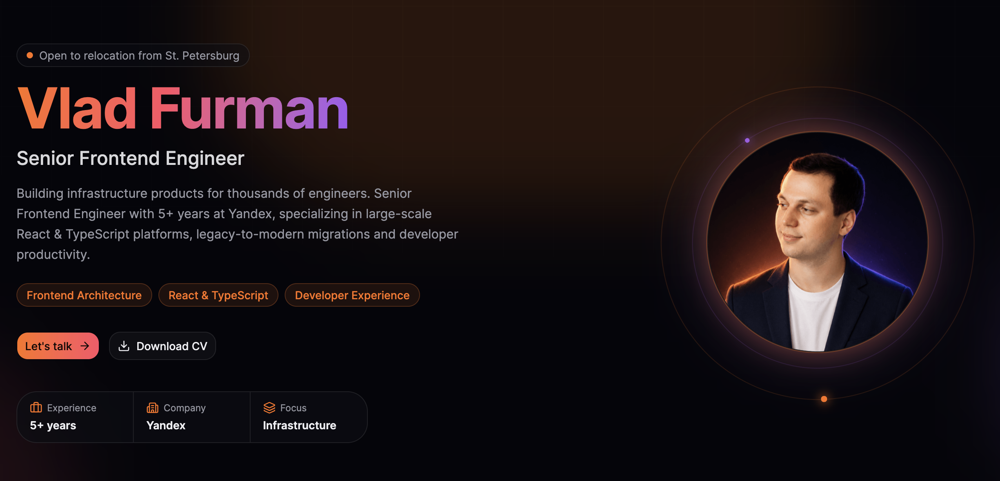

# CV — Vlad Furman

Personal CV site for **Vlad Furman**, Senior Frontend Engineer at Yandex. A single-page
profile with a matching print-ready PDF resume, built with React 19, TypeScript,
Vite and Tailwind CSS v4.



## Surfaces

The app ships two views behind minimal path-based routing (no router dependency,
see [`src/Main.tsx`](src/Main.tsx)):

- **`/`** — the interactive profile page ([`ProfilePage`](src/features/ProfilePage))
  with hero, Yandex experience, side projects, and a "Let's talk" contact form.
- **`/pdf`** — a print-optimized resume ([`PdfResume`](src/features/PdfResume))
  rendered as HTML, ready to save as PDF.

## Tech stack

- **React 19** + **TypeScript**
- **Vite 8** for dev/build
- **Tailwind CSS v4** for styling
- **Base UI** for accessible dialogs/fields, **Framer Motion** for animation,
  **lucide-react** for icons
- **Vitest** (unit) + **Playwright** (e2e) for tests
- A small Node **contact relay** under [`server/`](server) that the "Let's talk"
  form posts to (proxied by nginx in production, by Vite in dev)

## Getting started

```bash
pnpm install
pnpm dev        # http://127.0.0.1:5173  (visit /pdf for the resume)
```

## Scripts

| Command | Description |
| --- | --- |
| `pnpm dev` | Start the dev server |
| `pnpm build` | Type-check and build for production |
| `pnpm preview` | Preview the production build |
| `pnpm typecheck` | Run `tsc --noEmit` |
| `pnpm lint` | Lint with ESLint (zero warnings allowed) |
| `pnpm test` | Run unit tests (Vitest) |
| `pnpm test:e2e` | Run end-to-end tests (Playwright) |
| `pnpm codecheck` | Typecheck + lint + unit tests |

## Project structure

```
src/
  app/        # global styles
  features/
    ProfilePage/   # interactive profile (hero, experience, projects, contact)
    PdfResume/     # print-ready HTML resume served at /pdf
  shared/     # reusable UI and lib helpers
server/       # contact-form relay
```
